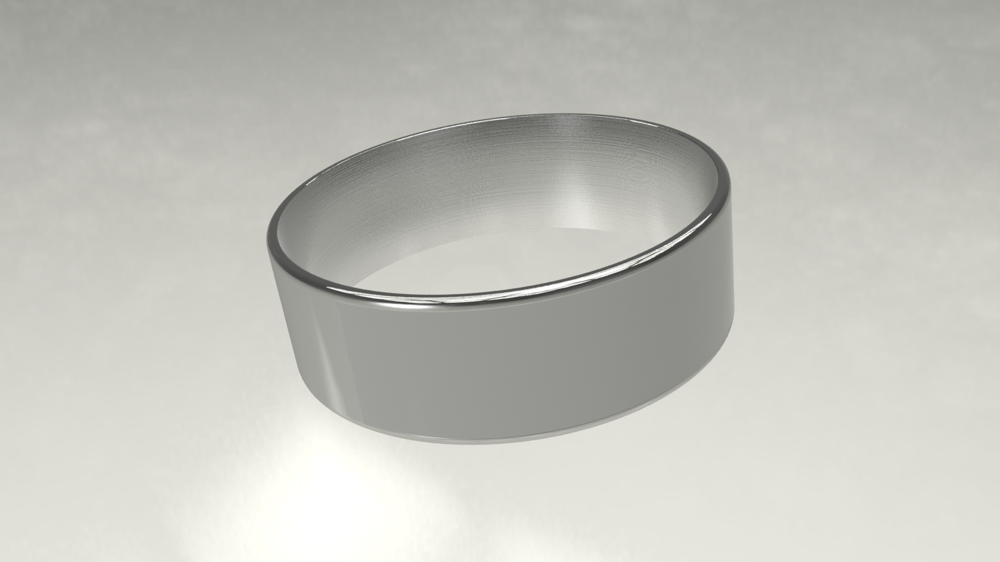
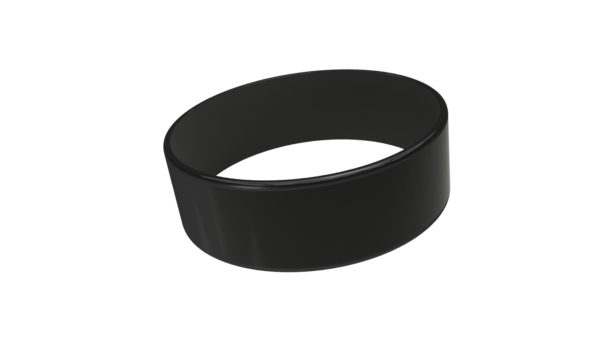
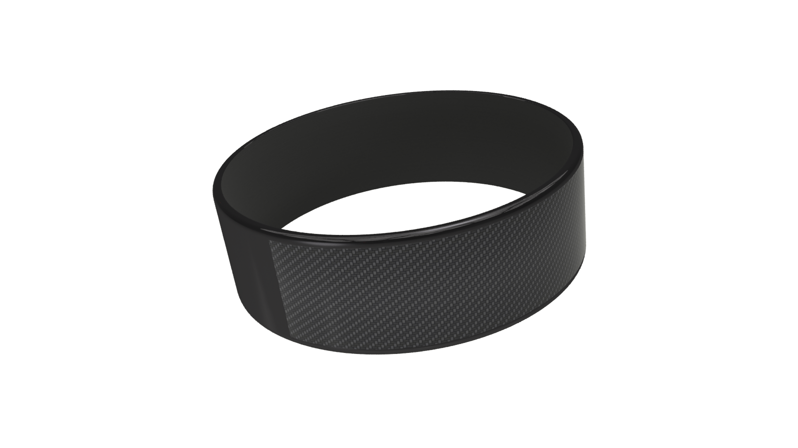

"NFC Ring Inlay Cover Color options on there way up now..." 

Note: On #16 -- Stealth Bomber The inner is actually black, for some reason I couldn't figure out how to render a black inside..  Pesky software, to be fair learned to use it today so..  Yea..

Black Carbon Fiber

Silver Carbon Fiber

Green

Orange

Pink

Purple

#

Red

White

Wood

Yellow

Blue

Black

Actual Silver

Rainbow

Black Metal & Black

Blue Metal & White

Stealth Bomber (Note Black Carbon Fiber on top, Black on Black on bottom)

